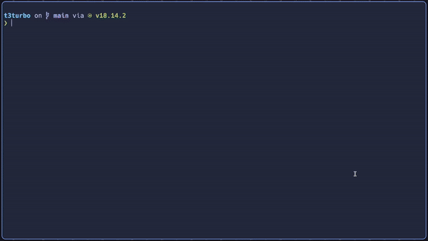

# monorepo.nvim


***monorepo.nvim*** is a plugin to manage the scope of monorepos inside of neovim! 

Its goal is to make juggling multiple projects inside of a monorepo a little easier, in combination with Telescope's `find_files`.

## Requirements
- [nvim-telescope/telescope.nvim](https://github.com/nvim-telescope/telescope.nvim) for the project picker
- [nvim-lua/plenary.nvim](https://github.com/nvim-lua/plenary.nvim) for some helper functions used internally

## Installing

Install the plugin (This example uses [lazy.nvim](https://github.com/folke/lazy.nvim))
```lua
{
  "imNel/monorepo.nvim",
  config = function()
    require("monorepo").setup({
      -- Your config here!
    })
  end,
  dependencies = { "nvim-telescope/telescope.nvim", "nvim-lua/plenary.nvim"},
  dev = true,
},
```

### Config Defaults
```lua
{
  silent = false, -- Supresses vim.notify messages
  autoload_telescope = true, -- Automatically loads the telescope extension at setup
  data_path = vim.fn.stdpath("data"), -- Path that monorepo.json gets saved to
}
```

The telescope extension beeds to be done at any point AFTER `require("telescope").setup()` and `require("monorepo").setup()`.
By default, this is done automatically but you can undo this by setting `{ autoload_telescope = false }` in the config.

This is the snippet you'll need to run to load the extension if doing it manually
```lua
require("telescope").load_extension("monorepo")
```

Set up your keybinds! 
```lua
vim.keymap.set("n", "<leader>m", function()
  require("telescope").extensions.monorepo.monorepo()
end)
vim.keymap.set("n", "<leader>n", function()
  require("monorepo").toggle_project()
end)
```

## Usage (These can be mapped to keybinds)

You can add the current file's directory to the project list (works in netrw and files)
```lua
:lua require("monorepo").add_project()
```

You can also remove it if you don't want it in the project list
```lua
:lua require("monorepo").remove_project()
```

You can also toggle these with a single command
```lua
:lua require("monorepo").toggle_project()
```

You can view the project list like this
```lua
:Telescope monorepo
```
or this
```lua
:lua require("telescope").extensions.monorepo.monorepo()
```

You can also use a prompt to manage your projects
```lua
-- You can use "add", "remove" or "toggle" here.
-- If you don't specify any, it defaults to add
:lua require("monorepo").prompt_project("add")
```

## FAQ
### Does this persist between sessions? Where does this save?
I use `vim.fn.stdpath("data")` to find the data path and then write a file called `monorepo.json`.
This defaults to `$HOME/.local/share/nvim/` but can be changed in the config with `{ data_path = '/path/to/directory' }`

## Extras features I wanna add in the future
- project.nvim support
- Lualine support??
- NerdTree support? what are popular trees/fs plugins?
- Give projects a "nickname"?
- Include info on projects?
- When opening a known subproject, it detects it
- Remove repeated code with add, remove and toggle
- Other ways to add projects
